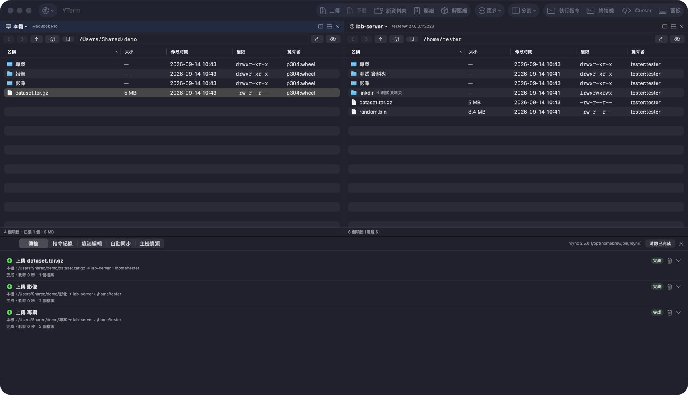
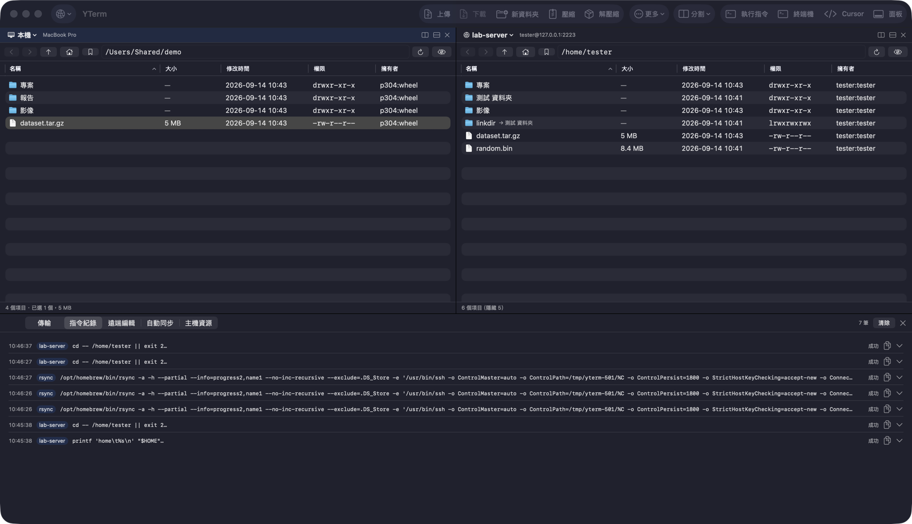
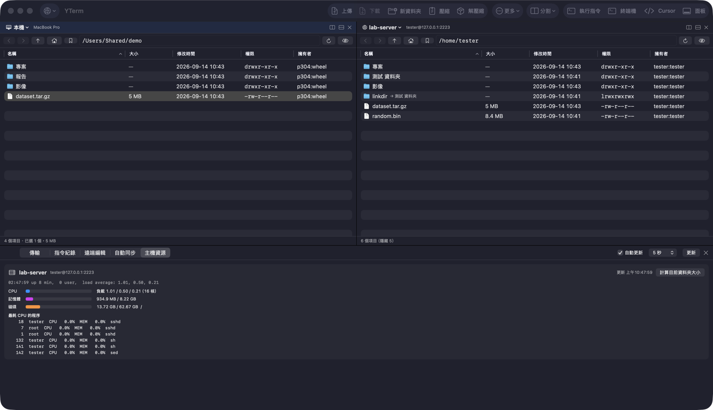

# YTerm

[](https://github.com/panhyer36/YTerm/actions/workflows/ci.yml)
[](https://github.com/panhyer36/YTerm/releases)


[](LICENSE)

macOS 雙欄 ssh／rsync 檔案管理程式（SwiftUI）。左本機、右遠端，所有操作都是實際執行的 `ssh`、`rsync`、`tar`、`zip` 指令，並可複製。



## 功能

- 面板可左右／上下分割，各自為本機或任一主機；面板間拖曳或按鈕傳輸。本機↔主機走 rsync，同主機 mv／cp，主機↔主機經本機中轉
- 遠端 mv／cp／rm／mkdir／chmod／tar／zip／unzip 右鍵選單
- 指令紀錄：每條指令、結束碼與輸出
- ssh ControlMaster 共用連線；金鑰、`~/.ssh/config`（含 ProxyJump）、密碼（鑰匙圈 + SSH_ASKPASS）
- 遠端檔案本機編輯，儲存後自動上傳，保留權限與擁有者
- 自動同步：FSEvents 監看本機資料夾，變動後 rsync 推送（可鏡像、排除）；「檢查遠端變更」以試跑列出差異並勾選下載
- 書籤與最近位置；主機資源（負載、記憶體、磁碟、GPU、程序）
- 執行單行指令、Terminal.app、Cursor（Remote-SSH）

| 指令紀錄 | 主機資源 |
| --- | --- |
|  |  |

## 需求

- macOS 14+，Xcode 15+（Swift 5.9+）
- 遠端主機：`rsync`
- 本機：建議 Homebrew `rsync`（整體進度）；內建 openrsync 亦可

## 建置

```bash
swift run                 # 開發執行
./scripts/build-app.sh    # build/YTerm.app（release、ad-hoc 簽章）
swift test
```

未公證，首次開啟需右鍵「打開」或：

```bash
xattr -d com.apple.quarantine /Applications/YTerm.app
```

## 快速鍵

| 操作 | 快速鍵 |
| --- | --- |
| 上傳／下載 | ⌘U／⌘D |
| 本機編輯 | ⌘O |
| 執行指令／終端機 | ⌘E／⇧⌘T |
| 分割 左右／上下 | ⌘\\／⇧⌘\\ |
| 關閉面板／切換面板 | ⇧⌘W／⌘] |
| 加入書籤 | ⇧⌘B |
| 設定 | ⌘, |

## 測試

```bash
scripts/test-server/run.sh   # Docker Ubuntu sshd，127.0.0.1:2223，輸出整合測試指令
```

## 結構

```
Sources/YTerm/
  App/       AppState、PaneModel、TransferManager、RemoteEditing、AutoSync、Bookmarks、設定
  Models/    FileEntry、ArchiveKind、HostProfile
  Services/  LocalExecutor／RemoteConnection、RemoteListing、Rsync、SSHConfigParser、KeychainStore、HostResources
  Views/     面板、工具列、對話框、底部面板、設定
Tests/       引號、路徑、列表解析、ssh config、rsync 參數與進度
scripts/     build-app.sh、make-icon.swift、test-server/
```

## 限制

- 首次連線自動接受主機金鑰（`StrictHostKeyChecking=accept-new`），金鑰變更則拒絕
- 遠端刪除為 `rm -rf`（先確認，拒絕 `/` 與家目錄）；本機刪除移至垃圾桶
- 拖放只接受放入面板目前資料夾

## 授權

[MIT](LICENSE)
